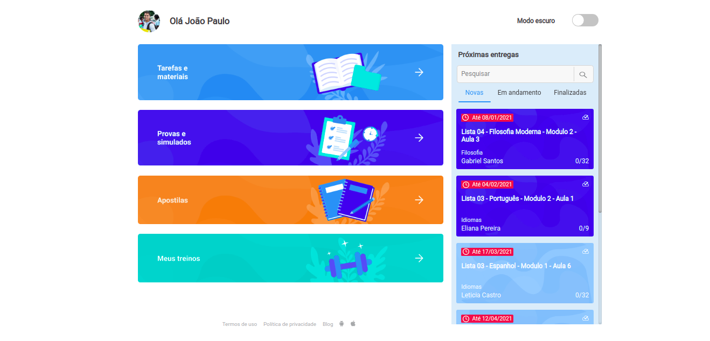
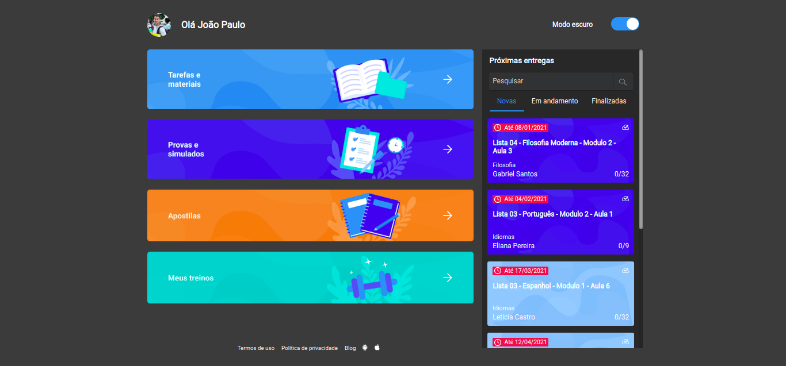
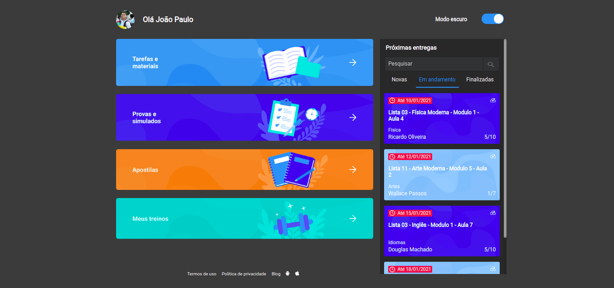
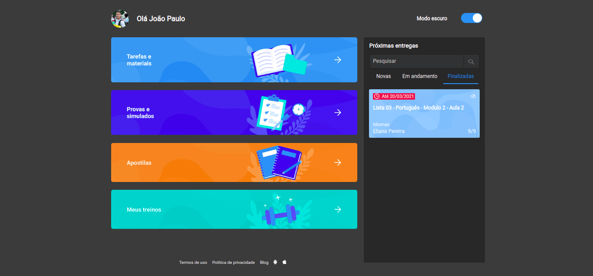
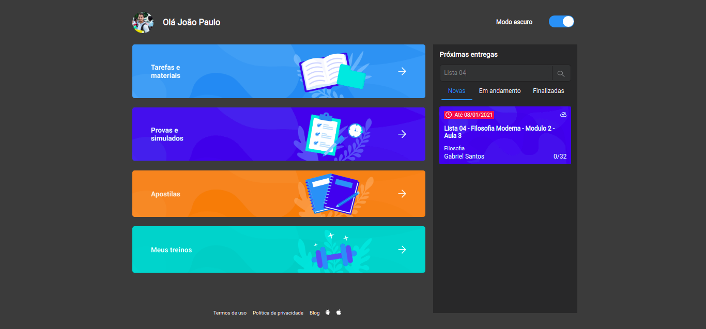

<h1 align="center">
  
</h1>

<h1 align="center">
  
</h1>

<h1 align="center">
  
</h1>

<h1 align="center">
  
</h1>

<h1 align="center">
  
</h1>

Aplicação construida com base em um desfio proposto por uma empresa. 

#

<ol>
  <li>As atividades do aluno devem retornar da API </li>
  <li>Devem ser separadas em abas de acordo com Novos, Em andamento e Finalizadas</li>
  <li>Devem ser ordenadas por data, da mais perto para a mais longe</li>
  <li>Deve ser exibido a quantidade de questões e quantas questões foram completadas em cada atividade</li>
  <li> Atividades do tipo 1 devem ser azul escuro e atividades do tipo 2 azul claro</li>
  <li> Ao ativar ou desativar o Modo escuro, o tema deve ser alterado</li>
</ol>

#

### Features
- [x] Página Home
- [x] Tema light / Dark 
- [x] Busca de dados das atividades por API
- [x] Busca os elementos que possuem o critério no título

#

### Tecnologias
- [React](https://pt-br.reactjs.org/)
- [Scss](https://sass-lang.com/)
- [Json-server](https://github.com/typicode/json-server)

#

### Autor

 
<b>Elves Brito</b>

